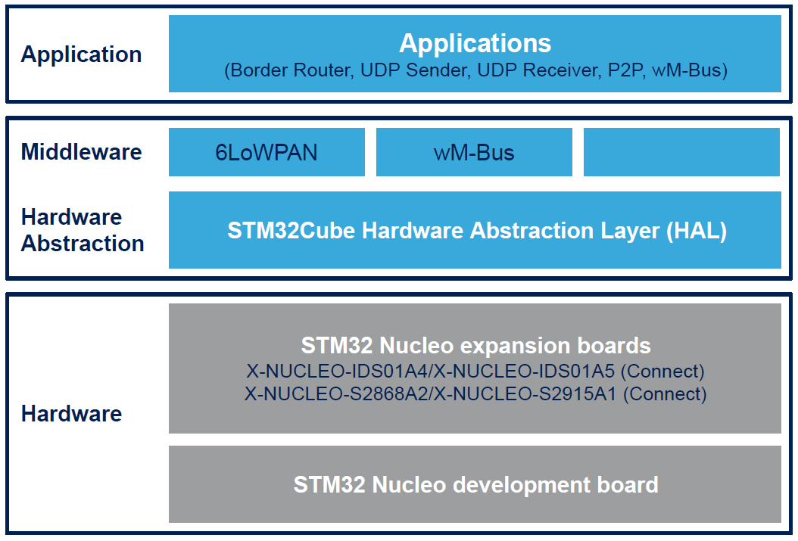

::: {.row}
::: {.col-sm-12 .col-lg-4}

# Release Notes for <mark>X-CUBE-SUBG1</mark>
Copyright &copy; [2021]{style="background-color: yellow;"} STMicroelectronics\
    
{.logo}

# License

This software package is
licensed by ST under SLA0077, the "License"; You may not use this component except in compliance
with the License. You may obtain a copy of the License at:

[[SLA0077: SOFTWARE LICENSE AGREEMENT]{style="background-color: yellow;"}
](http://www.st.com/content/st_com/en/search.html#q=SLA0077-t=keywords-page=1)

# Purpose

The X-CUBE-SUBG1 software package is an expansion for STM32Cube. This software provides drivers running on STM32 for STM's Radio (SPIRIT1 or S2-LP) Low data rate and low power sub-1GHz transceiver devices. It is built on top of STM32Cube software technology that ease portability across different STM32 micro-controllers. This expansion firmware is built over the X-NUCLEO-S2868A1 (or X-NUCLEO-S2868A2), X-NUCLEO-S2915A1, X-NUCLEO-IDS01A4 and X-NUCLEO-IDS01A5 demonstration kit. This expansion board can be plugged on the Arduino UNO R3 connectors of any STM32 Nucleo board. The user can mount the ST Morpho connectors if required. The different expansion boards can be easily stacked in order to evaluate different devices with Sub 1GHz communication

**X-CUBE-SUBG1 software features**:

 - Point-to-Point (P2P) communication example to transfer data from one node to another
 - Middleware to build applications for wM-Bus (wireless metering bus)
 - Contiki 6LoWPAN Middleware to build applications for Wireless Sensor Nodes using Mesh Network
 - Low Power features are available in Udp_sender and Udp_receiver applications for MCU (NUCLEO-L152RE) and Radio (X-NUCLEO-S2868A1)
 - Easy portability across different MCU families thanks to STM32Cube
 - Free user-friendly license terms
 - Examples implementations available on the X-NUCLEO-S2868A1/X-NUCLEO-S2868A2 (868 Mhz), X-NUCLEO-S2915A1 (915 Mhz), X-NUCLEO-IDS01A4 (868 MHz) or X-NUCLEO-IDS01A5 (915 MHz) STM32 expansion board plugged on top of one NUCLEO-F401RE or NUCLEO-L152RE or NUCLEO-L053R8

Here is the list of references to user documents:

- STM32Cube: [www.st.com/stm32cube](http://www.st.com/stm32cube)
- STM32 Nucleo boards: [www.st.com/stm32nucleo](http://www.st.com/stm32nucleo)
- STM32 Nucleo expansion boards: [www.st.com/x-nucleo](http://www.st.com/x-nucleo)
- [UM1904: Getting started with X-CUBE-SUBG1, Sub-1 GHz RF software expansion for STM32Cube](https://www.st.com/resource/en/user_manual/dm00189294-getting-started-with-xcubesubg1-sub1-ghz-rf-software-expansion-for-stm32cube-stmicroelectronics.pdf)
- [UM1892: Getting started with the X-CUBE-SUBG1 for wM-Bus communications based on Sub-1 GHz RF expansion board](https://www.st.com/resource/en/user_manual/dm00181126-getting-started-with-the-xcubesubg1-for-wmbus-communications-based-on-sub1-ghz-rf-expansion-board-stmicroelectronics.pdf)
- [UM2040: Getting started with Contiki6LP, Contiki OS and 6LoWPAN sub-1 GHz RF software expansion for STM32Cube](https://www.st.com/resource/en/user_manual/dm00279190-getting-started-with-contiki6lp-contiki-os-and-6lowpan-sub1-ghz-rf-in-xcubesubg1-expansion-for-stm32cube-stmicroelectronics.pdf)

:::

::: {.col-sm-12 .col-lg-8}
# Update History

::: {.collapse}
<input type="checkbox" id="collapse-section4" checked aria-hidden="true">
<label for="collapse-section1" aria-hidden="true">__3.3.0 / April 19th 2021__</label>

			

## Main Changes

### Product update

 - Added examples of wM-Bus in the workspace
 - Bug Fixes in the wM-Bus stack
 - Source files are added in the workspace for wM-Bus on S2LP
 - Bugfixes for 6LoWPAN solution
 - Bug Fixes in Radio BSPs and Components
 - New projects structure
 - Added support of STM32CubeIDE

## Contents

<small>The components flagged by "[]{.icon-st-update}" have changed since the
previous release. "[]{.icon-st-add}" are new.</small>

Drivers

  Name                                                        Version                                           License                                                                                                       Release note
  ----------------------------------------------------------- ------------------------------------------------- ------------------------------------------------------------------------------------------------------------- ------------------------------------------------------------------------------------------------------------------------------------------------
  **X-NUCLEO-S2868A1**                                        V1.2.0 []{.icon-st-update}                        [BSD 3-Clause](https://opensource.org/licenses/BSD-3-Clause)                                                  [release note](Drivers\BSP\X-NUCLEO-S2868A1\Release_Notes.html)
  **X-NUCLEO-IDS01Ax**                                        V1.1.0 []{.icon-st-update}                        [BSD 3-Clause](https://opensource.org/licenses/BSD-3-Clause)                                                  [release note](Drivers\BSP\X-NUCLEO-IDS01Ax\Release_Notes.html)
  **S2LP**                                                    V1.2.0 []{.icon-st-update}                        [BSD 3-Clause](https://opensource.org/licenses/BSD-3-Clause)                                                  [release note](Drivers\BSP\Components\S2LP\Release_Notes.html)
  **SPIRIT1**                                                 V3.2.5 []{.icon-st-update}                        [BSD 3-Clause](https://opensource.org/licenses/BSD-3-Clause)                                                  [release note](Drivers\BSP\Components\spirit1\Release_Notes.html)
  **STM32F4xx CMSIS**                                         V2.6.2                                            [BSD 3-Clause](https://opensource.org/licenses/BSD-3-Clause)                                                  [release note](Drivers\CMSIS\Device\ST\STM32F4xx\Release_Notes.html)
  **STM32F4xx HAL**                                           V1.7.4                                            [BSD 3-Clause](https://opensource.org/licenses/BSD-3-Clause)                                                  [release note](Drivers\STM32F4xx_HAL_Driver\Release_Notes.html)
  **BSP STM32F4xx_NUCLEO**                                    V1.2.7                                            [BSD 3-Clause](https://opensource.org/licenses/BSD-3-Clause)                                                  [release note](Drivers\BSP\STM32F4xx-Nucleo\Release_Notes.html)
  **STM32L0xx CMSIS**                                         V1.7.2                                            [BSD 3-Clause](https://opensource.org/licenses/BSD-3-Clause)                                                  [release note](Drivers\CMSIS\Device\ST\STM32L0xx\Release_Notes.html)
  **STM32L0xx HAL**                                           V1.8.2                                            [BSD 3-Clause](https://opensource.org/licenses/BSD-3-Clause)                                                  [release note](Drivers\STM32L0xx_HAL_Driver\Release_Notes.html)
  **BSP STM32L0xx_NUCLEO**                                    V2.1.1                                            [BSD 3-Clause](https://opensource.org/licenses/BSD-3-Clause)                                                  [release note](Drivers\BSP\STM32L0xx_Nucleo\Release_Notes.html)
  **STM32L1xx CMSIS**                                         V2.2.3                                            [BSD 3-Clause](https://opensource.org/licenses/BSD-3-Clause)                                                  [release note](Drivers\CMSIS\Device\ST\STM32L1xx\Release_Notes.html)
  **STM32L1xx HAL**                                           V1.3.1                                            [BSD 3-Clause](https://opensource.org/licenses/BSD-3-Clause)                                                  [release note](Drivers\STM32L1xx_HAL_Driver\Release_Notes.html)
  **BSP STM32L1xx_NUCLEO**                                    V1.1.2                                            [BSD 3-Clause](https://opensource.org/licenses/BSD-3-Clause)                                                  [release note](Drivers\BSP\STM32L1xx_Nucleo\Release_Notes.html)

Middlewares

  Name                                                        Version                                           License                                                                                                       Release note
  ----------------------------------------------------------- ------------------------------------------------- ------------------------------------------------------------------------------------------------------------- ------------------------------------------------------------------------------------------------------------------------------------------------
  **Contiki_STM32_Library**                                   V1.3.0 []{.icon-st-update}                        [SLA0055](http://www.st.com/SLA0055)                                                                          [release note](Middlewares\ST\Contiki_STM32_Library\Release_Notes.html)
  **Contiki6LP Middleware for STM32Cube**                     V1.5.0 []{.icon-st-update}                        [BSD 3-Clause](https://opensource.org/licenses/BSD-3-Clause)                                                  [CONTIKI LICENSE](Middlewares\Third_Party\Contiki\LICENSE) / [Contiki6LP MW release notes](Middlewares\Third_Party\Contiki\Contiki6LP_Release_Notes.html)
  **STM32 wM-Bus Library**                                    V2.5.1 []{.icon-st-update}                        [SLA0047](http://www.st.com/software_license_agreement_image_v2)                                              [release notes](Middlewares/ST/WMBUS_Library_2013/Release_Notes.html)

Documentation

 - [Doxygen documentation for Contiki6LP](Documentation\Contiki6LP.chm)
 - [Doxygen documentation for P2P Demo](Documentation\P2P_Firmware_Demo.chm)
 - [Doxygen documentation for wM-Bus 2013](Documentation\wM-Bus_Library2013.chm)
 - [Doxygen documentation for X-NUCLEO-IDS01Ax BSP](Documentation\X-NUCLEO-IDS01Ax_BSP.chm)
 - [Doxygen documentation for X-NUCLEO-S2868A1 BSP](Documentation\X-NUCLEO-S2868A1_BSP.chm)

## Known Limitations

- Several compilation warnings are coming from Contiki files that have not been modified, these warings do not affect the fuinctionality of the firmware.

## Development Toolchains and Compilers

- IAR System Workbench v8.50.9
- ARM Keil v5.32
- STM32CubeIDE v1.6.1

## Supported Devices and Boards

 - STM32F401RE, STM32L152RE and STM32L053R8 devices
 - X-NUCLEO-S2868A1, X-NUCLEO-S2868A2, X-NUCLEO-S2915A1
 - X-NUCLEO-IDS01A4, X-NUCLEO-IDS01A5
 - NUCLEO-F401RE Board RevC
 - NUCLEO-L152RE Board RevC
 - NUCLEO-L053R8 Board RevC

:::

::: {.collapse}
<input type="checkbox" id="collapse-section0"  aria-hidden="true">
<label for="collapse-section0" aria-hidden="true">__3.2.0 / December 16th 2019__</label>

			

## Main Changes

 - Added support for X-NUCLEO-S2915A1
 - The package automatically supports the new expansion board  X-NUCLEO-S2868A2 that is pin to pin compatible with X-NUCLEO-S2868A1

## Contents

 - STM32Cube HAL and Middlewares drivers
   - STM32F4xx drivers aligned to STM32CubeF4 V1.21.0
   - STM32L1xx drivers aligned to STM32CubeL1 V1.8.1
   - STM32L0xx drivers aligned to STM32CubeL0 V1.10.0
 - Documentation
   - Doxygen documentation for Contiki6LP
   - Doxygen documentation for P2P Demo
   - Doxygen documentation for wM-Bus 2013
   - Doxygen documentation for X-NUCLEO-IDS01Ax_BSP
 - Drivers
   - BSP X-NUCLEO-S2868A1 V1.1.0
   - BSP X-NUCLEO-IDS01Ax V1.0.0

 - Middlewares
   - STM32 wM-Bus Library V2.5.0
   - Contiki6LP Middleware for STM32Cube V1.4.0
   - Contiki_STM32_Library V1.2.0

## Development Toolchains and Compilers

 - IAR Embedded Workbench for ARM (EWARM) toolchain V8.32 + ST-Link
 - RealView Microcontroller Development Kit (MDK-ARM) toolchain V5.27 + ST-LINK
 - System Workbench for STM32 (SW4STM32) toolchain v1.16.0 (IDE 2.5.0) + ST-Link

## Supported Devices and EVAL boards

 - STM32F401RE, STM32L152RE and STM32L053R8 devices
 - X-NUCLEO-S2868A1, X-NUCLEO-S2868A2, X-NUCLEO-S2915A1
 - X-NUCLEO-IDS01A4, X-NUCLEO-IDS01A5
 - NUCLEO-F401RE Board RevC
 - NUCLEO-L152RE Board RevC
 - NUCLEO-L053R8 Board RevC

:::
::: {.collapse}
<input type="checkbox" id="collapse-section0"  aria-hidden="true">
<label for="collapse-section0" aria-hidden="true">__3.1.1 / June 1st 2019__</label>

			

## Main Changes

 - Fixed radio driver that caused a problem to Border Router for NUCLEO-F401RE platform.
 - Modified TIM implementation for rtimer-arch.
 - Modified heap/stack memory sizes.
 - UDP Client sends RPL parent in the message

## Contents

 - STM32Cube HAL and Middlewares drivers
   - STM32F4xx drivers aligned to STM32CubeF4 V1.21.0
   - STM32L1xx drivers aligned to STM32CubeL1 V1.8.1
   - STM32L0xx drivers aligned to STM32CubeL0 V1.10.0
 - Documentation
   - Doxygen documentation for Contiki6LP
   - Doxygen documentation for P2P Demo
   - Doxygen documentation for wM-Bus 2013
   - Doxygen documentation for X-NUCLEO-IDS01Ax_BSP
 - Drivers
   - BSP X-NUCLEO-S2868A1 V1.0.0
   - BSP X-NUCLEO-IDS01Ax V1.0.0

 - Middlewares
   - STM32 wM-Bus Library V2.5.0
   - Contiki6LP Middleware for STM32Cube V1.4.0
   - Contiki_STM32_Library V1.1.1

## Development Toolchains and Compilers

 - IAR Embedded Workbench for ARM (EWARM) toolchain V8.20.2 + ST-Link
 - RealView Microcontroller Development Kit (MDK-ARM) toolchain V5.24.2 + ST-LINK
 - System Workbench for STM32 (SW4STM32) toolchain v1.16.0 (IDE 2.5.0) + ST-Link

## Supported Devices and EVAL boards

 - STM32F401RE, STM32L152RE and STM32L053R8 devices
 - X-NUCLEO-S2868A1, X-NUCLEO-IDS01A4, X-NUCLEO-IDS01A5
 - NUCLEO-F401RE Board RevC
 - NUCLEO-L152RE Board RevC
 - NUCLEO-L053R8 Board RevC

:::

::: {.collapse}
<input type="checkbox" id="collapse-section0"  aria-hidden="true">
<label for="collapse-section0" aria-hidden="true">__3.1.0 / December 14th 2018__</label>

			

## Main Changes

 - Added support for Low Power (NUCLEO-L152RE and X-NUCLEO-S2868A1), demonstration available in Udp Sender and Udp Receiver applications.

## Contents

 - STM32Cube HAL and Middlewares drivers
   - STM32F4xx drivers aligned to STM32CubeF4 V1.21.0
   - STM32L1xx drivers aligned to STM32CubeL1 V1.8.1
   - STM32L0xx drivers aligned to STM32CubeL0 V1.10.0
 - Documentation
   - Doxygen documentation for Contiki6LP
   - Doxygen documentation for P2P Demo
   - Doxygen documentation for wM-Bus 2013
   - Doxygen documentation for X-NUCLEO-IDS01Ax_BSP
 - Drivers
   - BSP X-NUCLEO-S2868A1 V1.0.0
   - BSP X-NUCLEO-IDS01Ax V1.0.0

 - Middlewares
   - STM32 wM-Bus Library V2.5.0
   - Contiki6LP Middleware for STM32Cube V1.4.0
   - Contiki_STM32_Library V1.1.0

## Development Toolchains and Compilers

 - IAR Embedded Workbench for ARM (EWARM) toolchain V8.20.2 + ST-Link
 - RealView Microcontroller Development Kit (MDK-ARM) toolchain V5.24.2 + ST-LINK
 - System Workbench for STM32 (SW4STM32) toolchain v1.16.0 (IDE 2.5.0) + ST-Link

## Supported Devices and EVAL boards

 - STM32F401RE, STM32L152RE and STM32L053R8 devices
 - X-NUCLEO-S2868A1, X-NUCLEO-S2915A1, X-NUCLEO-IDS01A4, X-NUCLEO-IDS01A5
 - NUCLEO-F401RE Board RevC
 - NUCLEO-L152RE Board RevC
 - NUCLEO-L053R8 Board RevC

:::

::: {.collapse}
<input type="checkbox" id="collapse-section0"  aria-hidden="true">
<label for="collapse-section0" aria-hidden="true">__3.0.0 / June 1st 2018__</label>

			

## Main Changes

 - Added support of S2-LP expansion board.
 - Application: Serial Sniffer - integrated in 6LoWPAN
 - Update on STM32Cube HAL driver
 - Update of Middlewares

## Contents

 - STM32Cube HAL and Middlewares drivers
   - STM32F4xx drivers aligned to STM32CubeF4 V1.21.0
   - STM32L1xx drivers aligned to STM32CubeL1 V1.8.1
   - STM32L0xx drivers aligned to STM32CubeL0 V1.10.0
 - Documentation
   - Doxygen documentation for Contiki6LP
   - Doxygen documentation for P2P Demo
   - Doxygen documentation for wM-Bus 2013
   - Doxygen documentation for X-NUCLEO-IDS01Ax_BSP
 - Drivers
   - BSP X-NUCLEO-S2868A1 V1.0.0
   - BSP X-NUCLEO-IDS01Ax V1.0.0

 - Middlewares
   - STM32 wM-Bus Library V2.4.2
   - Contiki6LP Middleware for STM32Cube

## Development Toolchains and Compilers

 - IAR Embedded Workbench for ARM (EWARM) toolchain V8.11.3 + ST-Link
 - RealView Microcontroller Development Kit (MDK-ARM) toolchain V5.23 + ST-LINK
 - System Workbench for STM32 (SW4STM32) v2.0+ ST-Link

## Supported Devices and EVAL boards

 - STM32F401RE, STM32L152RE and STM32L053R8 devices
 - X-NUCLEO-S2868A1, X-NUCLEO-IDS01A4, X-NUCLEO-IDS01A5
 - NUCLEO-F401RE Board RevC
 - NUCLEO-L152RE Board RevC
 - NUCLEO-L053R8 Board RevC

:::

::: {.collapse}
<input type="checkbox" id="collapse-section0"  aria-hidden="true">
<label for="collapse-section0" aria-hidden="true">__2.0.0 / May 15th 2017__</label>

			

## Main Changes

 - Contiki/6LoWPAN integrated in Middleware
 - Update on STM32Cube HAL driver
 - Minor updates in Point-to-Point demo application files

## Contents

 - STM32Cube HAL and Middlewares drivers
   - STM32F4xx drivers aligned to STM32CubeF4 V1.16.0
   - STM32L1xx drivers aligned to STM32CubeL1 V1.7.0
   - STM32L0xx drivers aligned to STM32CubeL0 V1.9.0
 - Documentation
   - Doxygen documentation for P2P Demo
   - Doxygen documentation for wM-Bus 2013
 - Drivers
   - BSP X-NUCLEO-IDS01Ax V1.0.0

 - Middlewares
   - STM32 wM-Bus Library V2.4.2
   - Contiki6LP Middleware for STM32Cube

## Development Toolchains and Compilers

 - IAR Embedded Workbench for ARM (EWARM) toolchain V7.80.2 + ST-Link
 - RealView Microcontroller Development Kit (MDK-ARM) toolchain V5.23 + ST-LINK
 - System Workbench for STM32 (SW4STM32) v2.0+ ST-Link

## Supported Devices and EVAL boards

 - STM32F401RE, STM32L152RE and STM32L053R8 devices
 - X-NUCLEO-IDS01A4, X-NUCLEO-IDS01A5
 - NUCLEO-F401RE Board RevC
 - NUCLEO-L152RE Board RevC
 - NUCLEO-L053R8 Board RevC

:::

::: {.collapse}
<input type="checkbox" id="collapse-section0"  aria-hidden="true">
<label for="collapse-section0" aria-hidden="true">__1.2.0 / September 14th 2016__</label>

			

## Main Changes

 - Update on STM32Cube HAL driver
 - Updated SPIRIT1 Library compliant to SPIRIT1-DK STSW-CONNECT009 V2.2.1
 - Updated wM-Bus Library compliant to wM-Bus 2013 standard

## Contents

 - STM32Cube HAL and Middlewares drivers
   - STM32F4xx drivers aligned to STM32CubeF4 V1.13.1
   - STM32L1xx drivers aligned to STM32CubeL1 V1.6.0
   - STM32L0xx drivers aligned to STM32CubeL0 V1.7.0
 - Documentation
   - Doxygen documentation for P2P Demo
   - Doxygen documentation for wM-Bus 2013
 - Drivers
   - BSP X-NUCLEO-IDS01Ax V1.0.0

 - Middlewares
   - STM32 wM-Bus Library V2.4.2

## Known Limitations

WARNING: SPI peripheral can go in timeout for F4 MCU families, due to a bug in the HAL_SPI_TransmitReceive() function In case of problems, you can call the __HAL_SPI_CLEAR_OVRFLAG() macro to clear the overrun flag before using the HAL_SPI_TransmitReceive() function.

## Development Toolchains and Compilers

 - IAR Embedded Workbench for ARM (EWARM) toolchain V7.60.1 + ST-Link
 - RealView Microcontroller Development Kit (MDK-ARM) toolchain V5.17 + ST-LINK
 - System Workbench for STM32 (SW4STM32) v1.7+ ST-Link

## Supported Devices and EVAL boards

 - STM32F401RE, STM32L152RE and STM32L053R8 devices
 - X-NUCLEO-IDS01A4, X-NUCLEO-IDS01A5
 - NUCLEO-F401RE Board RevC
 - NUCLEO-L152RE Board RevC
 - NUCLEO-L053R8 Board RevC

:::

::: {.collapse}
<input type="checkbox" id="collapse-section0"  aria-hidden="true">
<label for="collapse-section0" aria-hidden="true">__1.1.1 / April 4th 2016__</label>

			

## Main Changes

 - STM32L1xx Support added
 - Update on STM32Cube HAL driver
 - Updated SPIRIT1 Library compliant to SPIRIT1 DK_2.1.0

## Contents

 - STM32Cube HAL and Middlewares drivers
   - STM32F4xx drivers aligned to STM32CubeF4 V1.11.0
   - STM32L1xx drivers aligned to STM32CubeL1 V1.5.0
   - STM32L0xx drivers aligned to STM32CubeL0 V1.5.0
 - Documentation
   - Doxygen documentation for P2P Demo
   - Doxygen documentation for wM-Bus
 - Drivers
   - BSP X-NUCLEO-IDS01Ax V1.0.0

 - Middlewares
   - STM32 wM-Bus Library V1.0.8

## Known Limitations

WARNING: SPI peripheral can go in timeout for F4 MCU families, due to a bug in the HAL_SPI_TransmitReceive() function In case of problems, you can call the __HAL_SPI_CLEAR_OVRFLAG() macro to clear the overrun flag before using the HAL_SPI_TransmitReceive() function.

## Development Toolchains and Compilers

 - IAR Embedded Workbench for ARM (EWARM) toolchain V7.50.2 + ST-Link
 - RealView Microcontroller Development Kit (MDK-ARM) toolchain V5.17 + ST-LINK
 - System Workbench for STM32 (SW4STM32) v1.7+ ST-Link

## Supported Devices and EVAL boards

 - STM32F401RE, STM32L152RE and STM32L053R8 devices
 - X-NUCLEO-IDS01A4, X-NUCLEO-IDS01A5
 - NUCLEO-F401RE Board RevC
 - NUCLEO-L152RE Board RevC
 - NUCLEO-L053R8 Board RevC

:::

::: {.collapse}
<input type="checkbox" id="collapse-section0"  aria-hidden="true">
<label for="collapse-section0" aria-hidden="true">__1.0.0 / April 10th 2015__</label>

			

## Main Changes

 - First official release of firmware for X-NUCLEO-IDS01Ax(x=4,5) Expansion Board

## Contents

 - Drivers
   - Cortex-M CMSIS V3.20
   - STM32F4xx CMSIS V2.2.0
   - STM32F4xx HAL V1.2.0
   - STM32L0xx HAL V1.0.0
   - STM32L0xx CMSIS V1.0.1
   - BSP STM32F4xx_NUCLEO V1.2.0
   - STM32L0xx HAL V1.0.0
   - BSP STM32L0xx_NUCLEO V1.0.0
   - BSP X-NUCLEO-IDS01Ax V1.0.0
   - BSP SPIRIT1 V3.0.1

 - Middlewares
   - STM32 wM-Bus Library V1.0.8

## Development Toolchains and Compilers

 - IAR Embedded Workbench for ARM (EWARM) toolchain V7.20 + ST-Link
 - RealView Microcontroller Development Kit (MDK-ARM) toolchain V5.12 + ST-LINK
 - System Workbench for STM32 (SW4STM32)+ ST-Link

## Supported Devices and EVAL boards

 - STM32F401RE and STM32L053R8 devices
 - X-NUCLEO-IDS01A4, X-NUCLEO-IDS01A5

:::

:::
:::

<footer class="sticky">
::: {.columns}
::: {.column width="95%"}
For complete documentation on **X-CUBE-SUBG1** ,
visit: [[X-CUBE-SUBG1](https://www.st.com/en/embedded-software/x-cube-subg1.html)]{style="background-color: yellow;"}
:::
::: {.column width="5%"}

:::
:::
</footer>
